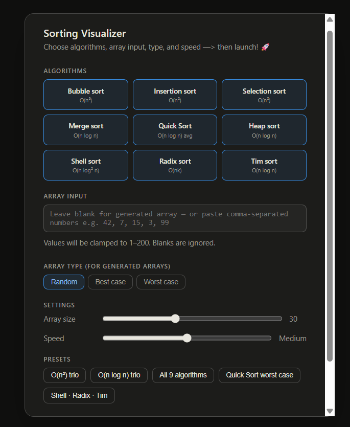
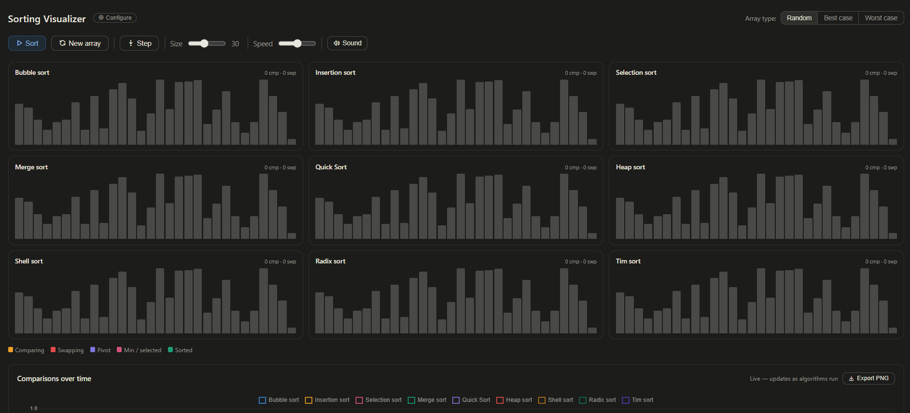

# Sorting Visualizer

An interactive, side-by-side sorting algorithm visualizer built with vanilla HTML, CSS, and JavaScript — no frameworks, no build step, one file.

<p align="center">
  
</p>

<p align="center">
  <a href="https://ajunabia228.github.io/sorting-visualizer">
    
  </a>
</p>

---

## Features

- **6 algorithms** animated simultaneously — Bubble, Insertion, Selection, Merge, Quick Sort, Heap
- **Quick Start menu** — pick algorithms, array type, size, and speed before launching
- **Best / Worst / Random case toggle** — see how nearly-sorted or reverse-sorted input affects each algorithm in real time
- **Live complexity graph** — Chart.js line chart plotting cumulative comparisons vs steps; O(n²) curves diverge visibly from O(n log n) ones
- **Color-coded bar states** — comparing (amber), swapping (red), pivot (purple), selected/min (pink), sorted (green)
- **Presets** — O(n²) comparison, O(n log n) only, All 6, Quick Sort worst case
- **Adjustable array size** (10–60 elements) and **5 speed levels**
- **Dark mode** support via `prefers-color-scheme`
- Zero dependencies at runtime — Chart.js loaded from CDN, Tabler icons via CDN

---

## Algorithms

<p align="center">
  
</p>

| Algorithm      | Best case   | Average     | Worst case  | Space  |
|----------------|-------------|-------------|-------------|--------|
| Bubble sort    | O(n)        | O(n²)       | O(n²)       | O(1)   |
| Insertion sort | O(n)        | O(n²)       | O(n²)       | O(1)   |
| Selection sort | O(n²)       | O(n²)       | O(n²)       | O(1)   |
| Merge sort     | O(n log n)  | O(n log n)  | O(n log n)  | O(n)   |
| Quick Sort     | O(n log n)  | O(n log n)  | O(n²)       | O(log n)|
| Heap sort      | O(n log n)  | O(n log n)  | O(n log n)  | O(1)   |

---

## Getting Started

### Run locally

No install needed. Just open the file:

```bash
git clone https://github.com/ajunabia228/sorting-visualizer.git
cd sorting-visualizer
open index.html        # macOS
start index.html       # Windows
xdg-open index.html    # Linux
```

Or serve it with any static server:

```bash
npx serve .
# → http://localhost:3000
```

---

## Deploy to GitHub Pages

### First-time setup

```bash
# 1. Initialize the repo (if not already)
git init
git add index.html README.md
git commit -m "feat: sorting visualizer — 6 algorithms, complexity graph, best/worst case"

# 2. Create the remote repo and push
gh repo create sorting-visualizer --public --source=. --remote=origin --push

# Or manually if you don't have the GitHub CLI:
git remote add origin https://github.com/ajunabia228/sorting-visualizer.git
git branch -M main
git push -u origin main
```

```
# 3. Enable GitHub Pages
# → Go to your repo on GitHub
# → Settings → Pages → Source: Deploy from branch
# → Branch: main / (root) → Save
```

Your site will be live at `https://ajunabia228.github.io/sorting-visualizer/` within ~60 seconds.

### Pushing updates

```bash
git add index.html
git commit -m "feat: add step-through mode"
git push
```

GitHub Pages redeploys automatically on every push to `main`.

---

## Project Structure

```
sorting-visualizer/
├── index.html      # entire app — HTML, CSS, and JS in one file
└── README.md
```

---

## Tech Stack

- **Vanilla JS** — all sorting logic and animation
- **Chart.js 4** — complexity graph (loaded from CDN)
- **Tabler Icons** — UI icons (loaded from CDN)
- **CSS custom properties** — theming and dark mode
- **GitHub Pages** — hosting

---

## License

[MIT](LICENSE) — free to use, fork, and build on.